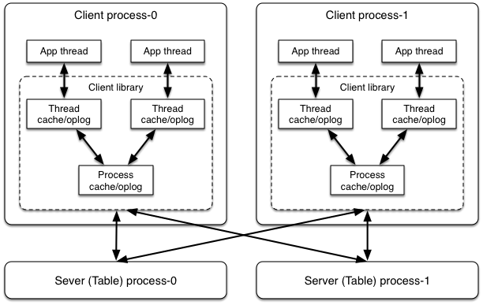
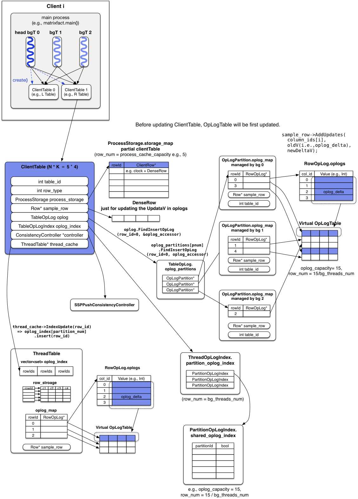

# ClientTable Upadte

##  总体架构


这个是物理架构图，但实际实现比这张图复杂。可以看到为了减少Server里Table的访问次数，Petuum在Client端设计了两级缓存，分别是Thread级别和Process级别的缓存。

## ClientTable结构图


ClientTable实际存放在ProcessStorage中，但相对于ServerTable来说，ProcessStorage中存放的Table只是ServerTable的一部分，甚至可以设置ClientTable的row_num为0，这样就可以减少Client端的内存使用量。

## ClientTable初始化

ClientTable属性：

| Name | Default | Description | L Table |
|:-----|:------|:-------|:-------|
| table\_info.row\_type| N/A | row type (e.g., 0 表示 DenseRow) | 0 |
| process\_cache\_capacity| 0 | Table 里的 row个数| matrix.getN() |
| table\_info.row\_capacity| 0 | 对于 DenseRow，指column个数，对SparseRow无效| K |
| table\_info.table_staleness | 0 | SSP staleness | 0 |
| table\_info.oplog\_capacity | 0 | OpLogTable里面最多可以写入多少个row | 100 |

每个bg thread持有一个OpLogTable，OpLogTable的`row_num = oplog_capacity / bg_threads_num`。

代码分析：

```c++
void SSPConsistencyController::BatchInc(int32_t row_id,
  const int32_t* column_ids, const void* updates, int32_t num_updates) {

  // updates就是每个col上要increase的value。
  // 比如，col 1和col 3都要加1，那么column_ids = {1, 3}，updates = {1, 1}
  // thread_cache_是ThreadTable的指针，ThreadTable就是ClientTable或者ServerTable
  // IndexUpadte(row_id)会
  thread_cache_->IndexUpdate(row_id);

  OpLogAccessor oplog_accessor;
  oplog_.FindInsertOpLog(row_id, &oplog_accessor);

  const uint8_t* deltas_uint8 = reinterpret_cast<const uint8_t*>(updates);

  for (int i = 0; i < num_updates; ++i) {
    void *oplog_delta = oplog_accessor.FindCreate(column_ids[i]);
    sample_row_->AddUpdates(column_ids[i], oplog_delta, deltas_uint8
			    + sample_row_->get_update_size()*i);
  }

  RowAccessor row_accessor;
  bool found = process_storage_.Find(row_id, &row_accessor);
  if (found) {
    row_accessor.GetRowData()->ApplyBatchInc(column_ids, updates,
                                             num_updates);
  }
}
```


## ClientTable属性解释

```c++
Class ClientTable {
	private:
	  // table Id
	  int32_t table_id_;
	  // Table里面row的类型，比如DenseRow<float>
	  int32_t row_type_;
	  // Row的游标（指针）
	  const AbstractRow* const sample_row_;
	  // Table的更新日志
	  TableOpLog oplog_;
	  // 进程里cache的Table
	  ProcessStorage process_storage_;
	  // Table的一致性控制协议
	  AbstractConsistencyController *consistency_controller_;

	  // ThreadTable就是ClientTable或者ServerTable
	  // thread_cahce就是Threads维护的ClientTable的全局对象
	  boost::thread_specific_ptr<ThreadTable> thread_cache_;
	  // 操作日志，每个bg thread对应一个index value
	  TableOpLogIndex oplog_index_;
}
```