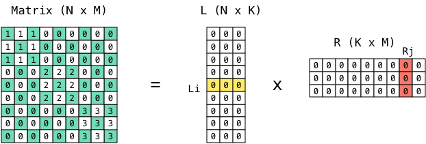
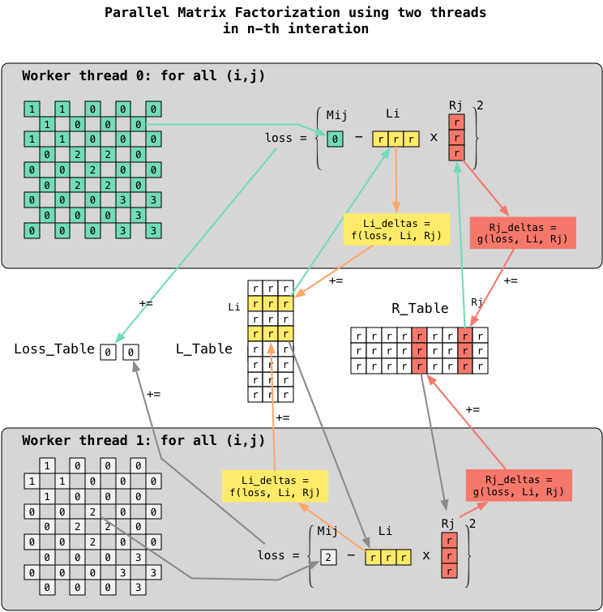
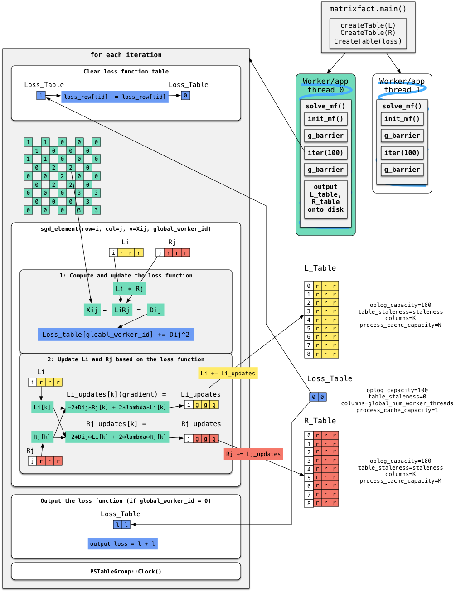

# Analysis of Matrtix Factorization

## 算法

矩阵LR分解是将一个N * M 的矩阵分解为N * K的L矩阵和K * M的R矩阵。

根据`rank(AB) ≤ min(rank(A), rank(B))`可知，如果Matrix的秩大于K，那么LR分解后的矩阵乘积会丢失Matrix的一些信息，类似PCA和SVD。

## 算法并行化

## 在PS上实现矩阵分解算法

