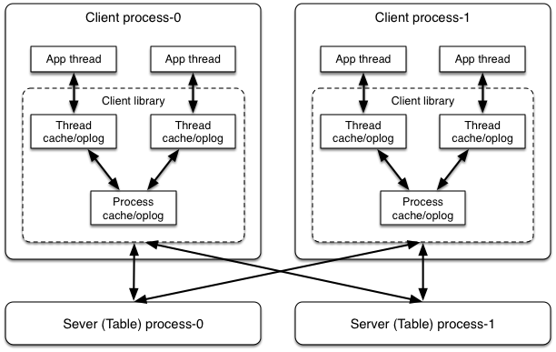

# Petuum原理

## LazyTable基本架构

1. 存放parameters的table的rows分布在多个tablet servers上。
2. 执行一个App script后，PS会在每个Client都会运行一个App program (e.g., matrixfact.main())，每个App program可以生成多个app threads。App thread相当于MapReduce/Spark中的task。
3. App thread通过client library来访问相应的table servers获取所需的table中的rows。
4. Client library维护了一个多级cache和operation logs来减少与table server的交互。

## LazyTable数据模型与访问API

### Data model: Table[row(columns)]

由于ML中算法基本使用vector或者matrix，所以可以用Table来存储参数。

与二维表类似，一个Table（比如matrixfact中的`L_Table`）包含多个row，row一般是`denseRow`或者`sparseRow`，一个row包含多个column。具体的parameter存在table中的cell中。具体实现时，Table可以用`hashmap<rowid, row>`来实现。

由于Table中的paramters会被多个threads更新，所以row支持一些聚合操作，比如plus, multiply, union。

### LazyTable操作

因为要对Table进行读写更新操作，因此Table需要支持一些操作，LazyTable的操作接口借鉴了Piccolo的接口：

1. read(tableid, rowid, slack)

	读取row，如果local cache中存在该row且其slack满足staleness bound（也就是local cache中的参数足够新），那么从local cache读取该row，否则暂停读取线程（the calling thread waits）。这个API也是唯一可以block calling thread的API。
	
2. update(tableid, rowid, delta)

	更新table中row的参数，newParameter = oldParameter + delta，这三个都是vector。
	
3. refresh(tableid, rowid, slack)

	如果process cache（被多个app thread共享）中的table中的row已经old了，就更新之。
	
4. clock()
	
	调用后表示calling thread已经进入到下一个周期，因为SSP不存在固定的barrier，所以这个看似会synchronization的API并不会block calling thread。
	
### Data freshness and consistency guarantees

1. 数据新鲜度保证：

	每个row有一个data age field（也就是clock）用于表示该row的数据新鲜度。假设一个row的当前data age是t，那么表示该row里面的参数 contains all updates from all app threads for1, 2, ..., t. 
	
	对于SSP来说，当calling thread在clock t的周期内发送`read(tableid, rowid, slack)`的请求时，如果相应row的`data age >= t-1-slack`，那么该row可以返回。

2. read-my-updates:

	ready-my-updates ensures that the data read by a thread contains all its own updates.

## LazyTable系统模块之Tablet Servers

### Tablet Servers基本功能

一个逻辑上的Table可以分布存放在不同的tablet server上，比如`L_Talbe`中的 i-th row 可以存在`tablet_server_id = i % total_num_of_servers`上。每个tablet server都将rows存放在内存中。

每个tablet server使用一个vector clock（也就是`vector<Clock>`）来keep track of rows的新鲜度。vector中第i个分量表示第i个row的clock，vector中最小的clock被定义为`global_clock_value`，比如`global_clock_value = t` 表示所有的app threads都已经完成了clock t周期的计算及参数更新。问题：每个tablet server只存储table中的一部分rows，一部分rows达到了clock t就能说所有的app threads都完成了clock t周期的计算？

### Table updates

由于tablet server会不断收到来自多个app thread的update请求，tablet server会先将update请求做一个本地cache（将update请求放到pending updates list中）。当且仅当收到client发送clock()请求时，tablet server才会集中处理将这些updates。这样可以保证row的新鲜度由vector clock唯一决定。

### Table read

当tablet server收到client端发来的read请求，会先查看`global_clock_value` （为什么不是该row的data age？），如果tablet server中的row新鲜度满足requested data age要求（`global_clock_value >= t-1-slack`），那么直接返回row给client。否则，将read request放到pending read list里面，并按照requested data age排序（从大到小？）。当`global_clock_value`递增到requested data age时，tablet server再将相应的row返回给client。除了返回row，tablet server还返回data age和requester clock。前者是`global_clock_value`，后者是client's clock（说明了which updates from this client have been applied to the row data，client可以利用这个信息来清除一些本地的oplogs）。

## LazyTable系统模块之Client library

Client library与app threads在同一个process，用于将LazyTable API的调用转成message发送到tablet server。Client library包含多层caches和operation logs。Client library会创建一个或多个background threads （简称为bg threds）来完成propagating updates和receiving rows的工作。

Client library由两层 caches/oplogs 组成：process cache/oplog和thread cache/oplog。Process cache/oplog被同在一个进程中的所有app thread和bg thread共享。Each thread cache/oplog is exclusively associated with one app thread.（实现好像不是这样的）。Thread cache的引入可以避免在process cache端有过多的锁同步，但是只能cache一些rows。

Client library也使用vector clock来track app thread的clock，第i个分量代表第i个app thread已经进入的clock周期。

### Client updates
App thread调用update(deltas)后，会先去访问对应的thread cache/oplog，如果cache中相应的row存在，那么`thread.cache.row += update.deltas`，同时会update写入到oplog中。不存在就直接存起来。当app thread调用clock()，那么在thread oplog中的updates都会被push到process oplog中，同时`process.cache.row += updates.deltas`。如果thread cache/oplog不存在，update会直接被push到process cache/oplog。

当一个client process中所有app threads都完成clock为 t 的计算周期，client library会使用一个bg thread（是head bg thread么？）向table server发送一个消息，这个消息包含clock t，process oplogs中clock为 t 的updates。这些process cache/oplogs中的updates会在发送该消息后一直保留，直到收到server返回的更新后的rows。

### Client read

在clock t周期内，如果一个app thread想要去读row r with a slack of s，那么client library会将这个请求翻译成`read row r with data age >= t-s-1`。接着，client library会先去thread cache中找对应的且满足条件的row，如果不存在就去process cache中找，如果还找不到就向tablet server发送要read row r的请求，同时block calling thread，直到server返回row r。在process cache中每个row有一个tag来表示是否有row request正在被处理，这样可以同步其它的request统一row的请求。

当tablet server返回row r时，client library端有一个bg thread会接受到row r，同时接受requester clock rc。rc表示该client提交的clock t的updates已经被处理。之后，process oplog就可以清除`clock <= rc` 的update日志。为了保证 read-my-updates，接收到row r 后，会将process oplog中`clock > rc`的操作作用到row r上，这样就可以得到本地最新的row r。最后，前面接受row r的bg thread会跟心row r的clock并将其返回到waiting app threads。

## Prefetching and fault-tolerance
### 数据预取

LazyTable提供了预取API refresh()，函数参数与read()一样，但与read()不一样的地方是refresh()不会block calling thread。

LazyTable支持两种预取机制：conservative prefetching和aggressive prefetching。前者只在必要的时候进行refresh，如果`cache_age < t-s-1`，prefetcher才会发送一个`request(row = r, age >= t-s-1)`。对于Aggressive prefetching，如果当前的row不是最新的会主动去更新。

## Differences with Spark

1. Spark的通信模式比较简单，最复杂的是shuffle模块，需要redcuer去mapper端fetch数据。
2. 在PS中，client与server有频繁的交互通信。
