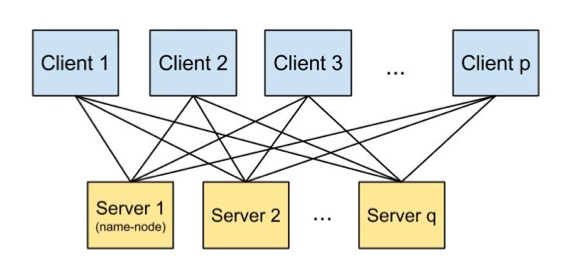
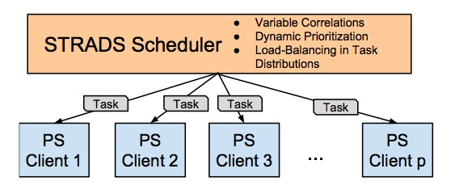
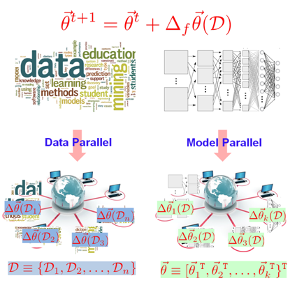

# Petuum基础


Petuum将ML算法应用分为两种类型：Big data（has many data samples）和Big Model（has very large parameter and intermediate variable spaces）。针对这两种应用，Petuum分别设计了两个系统功能模块及一个系统优化模块：

## 主要系统模块

- Distributed parameter server (i.e. key-value storage)
    - 用于global的参数同步，主要支持Big data类型算法的并行化，比如矩阵LR分解
- Distributed model scheduler (STRADS)
    - 调度worker tasks，主要支持Big Model类型算法的并行化，比如Lasso 
- Out-of-core (disk) storage for limited-memory situations
    - 针对内存不足的情况，设计的磁盘存储策略

前两种可以组合使用，但在目前的例子是分开使用的。

更详细的介绍：

We have develop a prototypic framework for Big ML called Petuum, which comprises several interrelated components, each focused on exploiting various specific properties of *iterative-convergent* behavior in ML. **The components can be used individually, or combined to handle tasks that require their collective capabilities.** Here, we focus on two components:
- **Parameter Server for global parameters:** Our parameter server(Petuum-PS) is a distributed key-value store that enables an easy-to-use, distributed-shared-memory model for writing distributed ML programs over **BIG DATA**. Petuum-PS supports novel consistency models such as bounded staleness, which achieve provably good results on iterative-convergent ML algorithms. Petuum-PS additionally offers several “tuning knobs” available to experts but otherwise hidden from regular users such as thread and process-level caching and read-my-write consistency. We also support out-of-core data streaming for datasets that are too large to fit in machine memory.


- **Variable Scheduler for local variables:** Our scheduler (STRADS) analyzes the variable structure of ML problems, in order to find parallelization opportunities over **BIG MODEL** while avoiding error due to strong dependencies. STRADS then dispatches parallel variable updates across a distributed cluster, while prioritizing them for maximum objective function progress. Throughout this, STRADS maintains load balance by dispatching new variable updates as soon as worker machines finish existing ones.



## 基本逻辑架构



An update function updates the model parameters and/or latent model states 𝜃 by some function 𝚫𝜃(𝓓) of the data 𝓓. Data parallelism divides the data 𝓓 among different workers, whereas model parallelism divides the parameters (and/or latent states) 𝜃 among different worker.

在左图中，数据是分布的但模型参数$\theta$没有分布，每个worker节点持有完整的参数，${worker}\_{i}$要在分块数据${D}\_{i}$上计算参数更新$\Delta\theta({D}\_{i})$（可以想象成梯度）。一般来说，如果参数可以batch update（不需要一个固定的更新顺序），那么计算$\Delta\theta({D}\_{i})$与计算$\Delta\theta({D}\_{j})$过程可以独立，就可以用PS的架构了。

在右图中，模型是分布的但数据没有分布，每个worker持有全部的数据，但只持有一部分参数${\theta}\_{i}$，${worker}\_{i}$在整个数据${D}$上计算一部分参数更新$\Delta{\theta}\_{i}(D)$。

## 基本算法
- Matrix Factorization
    - Stochastic Gradient Descent更新方式
    - a data-parallel algorithm
- LASSO regression
    - Coordinate Descent更新方式
    - a model-parallel algorithm

## 共享目录

**We highly recommend using Petuum in an cluster environment with a shared filesystem** (e.g. shared home directories).在实际环境中，这一条很难实现，目前cluster不会有共享的home目录。 Provided all machines are identically configured and have the necessary packages/libraries, you only need to compile Petuum (and any apps you want to use) once, from one machine. The Petuum ML applications are all designed to work in this environment, as long as the input data and configuration files are also available through the shared filesystem.

## PS的配置文件
```
0 ip_address_0 10000
1 ip_address_0 9999
1000 ip_address_1 9999
2000 ip_address_2 9999
3000 ip_address_3 9999
```

Each line in the server configuration file format specifies an ID (0, 1, 1000, 2000, etc.), the IP address of the machine assigned to that ID, and a port number (9999 or 10000). Every machine is assigned to one ID and one port, except for the first machine, which is assigned two IDs and two ports because it has a special role. 整个role就是NameNode。

If you want to simultaneously run two Petuum apps on the same machines, make sure you give them **separate** Parameter Server configuration files with **different ports**. **The apps cannot share the same ports!**

## ML App: Matrix Factorization
这个例子的运行过程文档已经讲的很清楚，这里再解释几个文档没有细讲的地方：
M = L * R，M是9x9的矩阵，分解后的L是9x3的矩阵，R是3x9的矩阵。

1. 当K=3时，MF的输出结果（L矩阵如下）：

    ```
    0.115764 1.03662 0.100797 
    0.115764 1.03662 0.100797 
    0.115764 1.03662 0.100797 
    -1.07724 0.107777 0.922327 
    -1.07724 0.107777 0.922327 
    -1.07724 0.107777 0.922327 
    1.16671 -0.218361 1.17542 
    1.16671 -0.218361 1.17542 
    1.16671 -0.218361 1.17542 
    
    ```
    可以发现是每三行几乎一样，原因是$rank(AB) \leq min(rank(A),rank(B))\leq K = 3$。当K=3是9的一个公约数时，分解得到三个线性无关的向量，但当K=4时，不是9的公约数时就没有这个特性了。

2. 当K=4时，MF的输出结果（R矩阵如下）：
    ```
    -0.0919685 -0.668313 0.789098 0.0187957 
    -0.225036 -0.585597 0.82593 0.123971 
    0.140019 -0.814718 0.724556 -0.16359 
    -0.839692 0.564146 0.475171 -0.915151 
    -0.728989 0.494618 0.444423 -1.00233 
    -0.790882 0.533725 0.46164 -0.953696 
    -1.03243 -1.04973 -0.924 -0.464828 
    -0.917422 -1.12158 -0.955918 -0.55563 
    -1.11345 -0.998635 -0.901482 -0.401137 
    ```

3. App configuration
    需要解释几个配置:
    - `client_worker_threads`: how many worker threads to use on each machine
    - `--staleness x`: turn on Stale Synchronous Parallel (SSP) consistency at staleness level x; often improves performance when using many machines
    -  `--lambda x`: sets the L2 regularization strength to x; default is 0
    -  `--offsetsfile x`: used to provide an "offsets file" for limited-memory situations; 
    -  `--init_step_size x`, --step_size_offset y, --step_size_pow z: used to control the SGD step size. The step size at iteration t is $x * {(y+t)}^{-z}$. Default values are $x=0.5, y=100, z=0.5$.
    -  `--ps_row_cache_size x`: controls the cache size of each worker machine. By default, the MF app caches the whole L, R matrices for maximum performance, but this means every machine must have enough memory to hold a full copy of L and R. If you are short on memory, set x to the maximum number of L rows and R columns you wish to cache. For example, `--ps_row_cache_size 100` forces every client to only cache 100 rows of L and 100 columns of R.

    
    比如要run一个client worker threads为4，staleness为5，lambda为0.1的MF例子：
    ```
    scripts/run_matrixfact.sh sampledata/9x9_3blocks 3 100 mf_output scripts/localserver 4 "--staleness 5 --lambda 0.1"
    ```
    