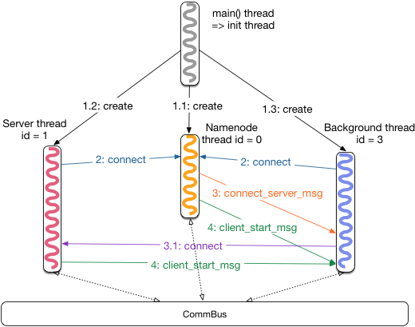
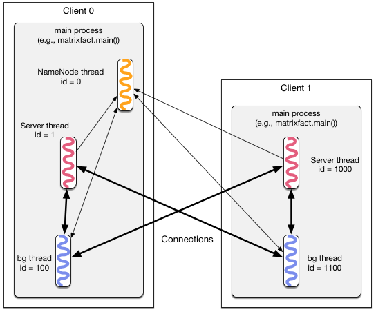

# Petuum的线程启动过程分析

Start PS的第一个步骤就是初始化各个线程
```c++
petuum::PSTableGroup::Init(table_group_config, false)
```
其具体实现是
- 初始化每个node上的namenode，background及server threads
- 建立这些threads之间的通信关系
- 为createTables()做准备

## Namenode thread
一个Petuum cluster里面只有一个Namenode thread，负责协同各个节点上的bg threads和server threads。


## Server thread
角色是PS中的Server，负责管理建立和维护用于存放parameters的global tables。

## Background (Bg) thread
角色是PS中的Client，负责管理真正计算的worker threads，并与server thread通信。在每个node上，bg threads可以有多个，其中一个负责建立本地 table。

## 代码结构与流程
.png)


## Local 模式线程启动分析

启动流程

```c++
// main thread调用PSTableGroup::Init()后变成init thread并向CommBus注册自己
I1230 10:00:50.570231  9821 comm_bus.cpp:117] CommBus ThreadRegister()
// init thread创建Namenode thread，该向CommBus注册自己
I1230 10:01:16.210435 10014 comm_bus.cpp:117] CommBus ThreadRegister()
// Namenode thread启动
NameNode is ready to accept connections!
// cluster中bg thread的个数
I1230 10:05:09.398447 10014 name_node_thread.cpp:126] Number total_bg_threads() = 1
// cluster中的server thread的个数
I1230 10:05:09.398485 10014 name_node_thread.cpp:128] Number total_server_threads() = 1
// app中定义的table_group_config的consistency_model = SSPPush or SSP
I1230 10:06:24.141788  9821 server_threads.cpp:92] RowSubscribe = SSPPushRowSubscribe
// 启动（pthread_create）所有的local server threads，这里只有一个
I1230 10:09:50.340092  9821 server_threads.cpp:106] Create server thread 0
// Server thread获取cluster中的client个数
I1230 10:12:15.419473 10137 server_threads.cpp:239] ServerThreads num_clients = 1
// Server thread自己的thread id
I1230 10:12:15.419505 10137 server_threads.cpp:240] my id = 1
// Server thread向CommBus注册自己
I1230 10:12:15.419514 10137 comm_bus.cpp:117] CommBus ThreadRegister()
// 注册成功
I1230 10:12:15.419587 10137 server_threads.cpp:252] Server thread registered CommBus
// Bg thread启动，id = 100，Bg thread的id从100开始
I1230 10:12:51.534554 10171 bg_workers.cpp:889] Bg Worker starts here, my_id = 100
// Bg thread向CommBus注册自己
I1230 10:12:51.534627 10171 comm_bus.cpp:117] CommBus ThreadRegister()
// Bg thread先去connect Namenode thread
I1230 10:12:51.534677 10171 bg_workers.cpp:283] ConnectToNameNodeOrServer server_id = 0
// Bg thread去连接Namenode thread
I1230 10:12:51.534683 10171 bg_workers.cpp:290] Connect to local server 0
// Namenode thread 收到Bg thread id = 100的请求
I1230 10:12:51.534826 10014 name_node_thread.cpp:139] Name node gets client 100
// Server thread首先去连接Namenode thread
I1230 10:13:18.879250 10137 server_threads.cpp:141] Connect to local name node
// Namenode thread收到Server thread的请求
I1230 10:13:21.051105 10014 name_node_thread.cpp:142] Name node gets server 1
// Namenode已经收到所有的client和server的连接请求
I1230 10:13:33.913213 10014 name_node_thread.cpp:149] Has received connections from all clients and servers, sending out connect_server_msg
// Namenode向所有client (bg thread) 发送让其连接server thread的命令
I1230 10:13:33.913254 10014 name_node_thread.cpp:156] Send connect_server_msg done
// 发送connect_server_msg命令完毕
I1230 10:13:33.913261 10014 name_node_thread.cpp:162] InitNameNode done
// 每个bg thread去连接cluster中的所有的server threads，这里只有一个server thread
I1230 10:13:33.929790 10171 bg_workers.cpp:283] ConnectToNameNodeOrServer server_id = 1
// Bg thread连接上了server thread
I1230 10:13:33.929821 10171 bg_workers.cpp:290] Connect to local server 1
// 收到Namenode的连接反馈消息（client_start_msg表示连接成功)
I1230 10:13:33.929862 10171 bg_workers.cpp:368] get kClientStart from 0 num_started_servers = 0
// Server thread初始化完成
I1230 10:23:39.355000 10137 server_threads.cpp:187] InitNonNameNode done
// Bg thread收到server thread的反馈信息（client_start_msg表示连接成功)
I1230 10:23:39.355051 10171 bg_workers.cpp:368] get kClientStart from 1 num_started_servers = 1
// Bg thread id＝100收到CreateTable的请求
I1230 10:23:39.355198 10171 bg_workers.cpp:911] head bg handles CreateTable
Data mode: Loading matrix sampledata/9x9_3blocks into memory...
```
Thread Ids: （local模式下Namenode，Server及Bg thread都只有一个）
- 9821: main() thread
- 10014: Namenode thread
- 10137: Server thread
- 10171: Bg thread

图解如下：



## Distributed 模式线程启动分析

启动图解如下：



可以看到各个节点上的线程启动后，Server threads和Bg threads都与Namenode threads建立了连接。然后Namenode通知所有的bg threads与集群中的所有server threads建立连接。连接建立后，可以看到Server threads和Bg threads组成了一个二分图结构，也就是所谓的Parameter Server。