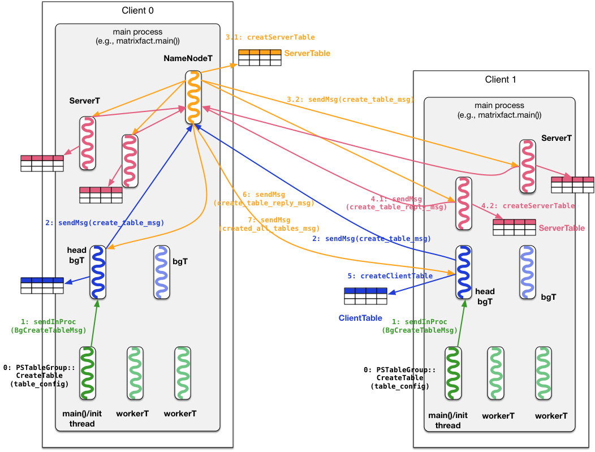

# CreateTable过程

## 基本流程

1. 每个App main Thread（比如每个节点上matrixfact.main()进程的main/init thread）调用`petuum::PSTableGroup::CreateTable(tableId, table_config)`来创建Table。
2. 该方法会调用同在一个Process里的head bg thread向NameNode thread发送创建Table的请求`create_table_msg`。
3. NameNode收到CreateTable请求，如果该Table还未创建，就在自己的线程里创建一个ServerTable。之后会忽略其他要创建同一Table的请求。
4. NameNode将CreateTable请求`create_table_msg`发送到cluster中的每个Server thread。
5. Server thread收到CreateTable请求后，先reply `create_table_reply_msg` to NameNode thread，表示自己已经知道要创建Table，然后直接在线程里创建一个ServerTable。
6. 当NameNode thread收到cluster中所有Server thread返回的reply消息后，就开始reply `create_table_reply_msg` to head bg thread说“Table已被ServerThreads创建”。
7. 当App main()里定义的所有的Table都被创建完毕（比如matrixfact里要创建三个Table），NameNode thread会向cluster中所有head bg thread发送“所有的Tables都被创建了”的消息，也就是`created_all_tables_msg`。

## 流程图

## 代码结构图

