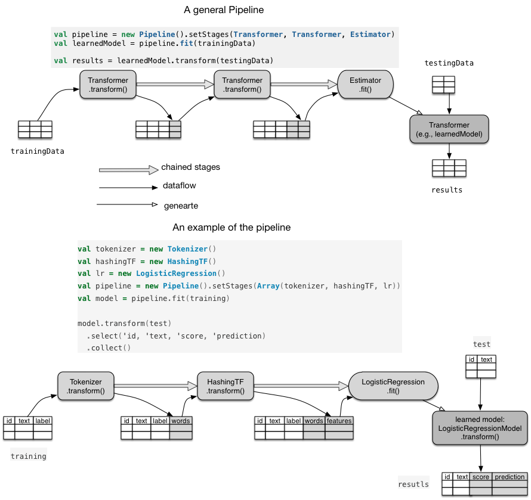
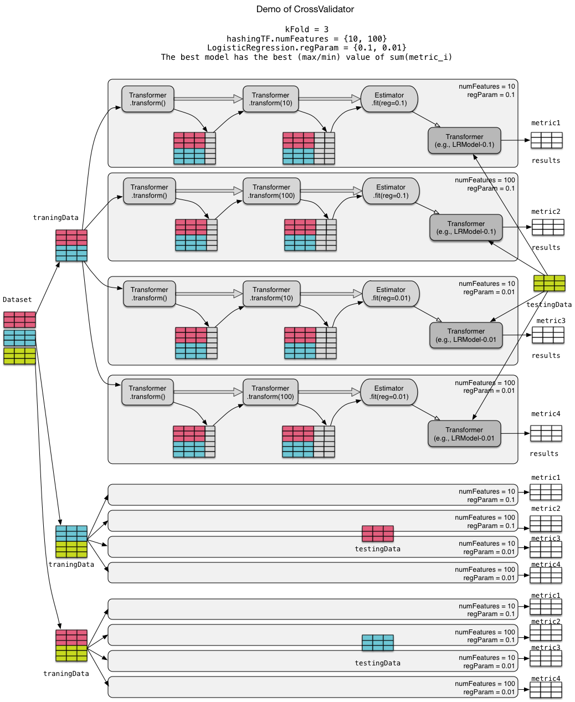
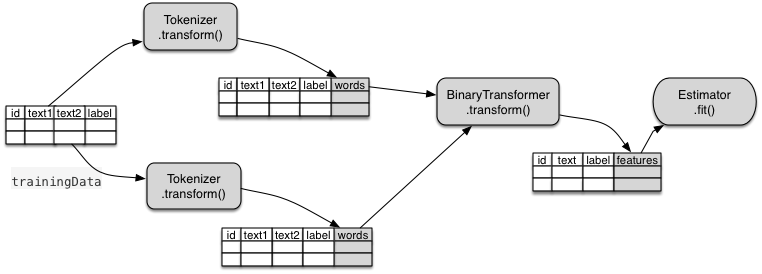

# Introduction to Spark ML Pipeline

## 说明
建议在阅读本文档之前先阅读[官方文档](http://spark.apache.org/docs/latest/ml-guide.html)，本文档不是官方文档的翻译，而是对Spark ML Pipeline的进一步理解与总结。

## From MLlib to Spark.ml
从1.2开始，Spark开始提供新的ML package，叫做Spark.ml。这个package提供的API接口比Spark.mllib更清晰更统一，当然最主要的特性是提供了ML pipeline功能。Spark.ml目前是alpha版本，仅包含LogisticRegression一个算法，但后面会加入更多的算法并取代现有的Spark.mllib。

## ML任务基本流程
在介绍ML pipeline之前，我们先回顾一下一个ML任务包含的典型流程：

1. 准备训练数据集 (training examples)
2. 预处理及特征抽取 (training examples => features)
3. 训练模型 (training models(features))
4. 在测试集上进行模型评测 (testing examples => features => results)

可以看到整个ML任务实际上是一个dataflow。更确切地，是两条dataflow。一条是training过程，结束点是训练好的model，另一条是testing过程，结束点是最后得到的results (e.g., predictions)。如果要训练多个模型，那么dataflow会有更多条。

从high-level的角度来看，dataflow里只包含两种类型的操作：数据变换（上面的=>）与模型训练（产生model）。

## Spark.ml原理
Spark.ml目的为用户提供简单易用的API，方便用户将整个training和testing的dataflow组织成一个统一的pipeline（其实叫workflow更合适）。Spark.ml里主要包含4个基本概念：

1. ML data model: Spark ML使用 Spark SQL里面的SchemaRDD来表示整个处理过程中的 input/output/intermediate data。一个SchemaRDD类似一个table，里面可以包含很多不同类型的column，column可以是text，feature，label，prediction等等。

2. Transformer: 俗称数据变形金刚。变形金刚可以从一样东西（比如汽车）变成另一样东西（人是不是东西？）。在Spark.ml中Transformer可以将一个SchemaRDD变成另一个SchemaRDD，变换方法由其 Transformer.transform()方法决定，整个过程与RDD.transformation()类似。可想而知，Transformer可以是feature抽取器，也可以是已经训练好的model，等等。比如，Spark.ml提供的一个`Tokenizer: Transformer `可以对training examples中的 text 进行Tokenization预处理，处理结果就是`Tokenizer.transform(text)`。
再比如Spark.ml中的LogisticRegressionModel也是一个Transformer，当它被训练好后，预测过程就是将testing examples中的features变成predictions，也就是`predictions = LogisticRegressionModel.transform(features)`。

3. Estimator: 形象地讲就是可以生产变形金刚的机器。比如要生产一个中国版的擎天柱，只需传入中国人的训练数据（比如中国人的身高，体重等），选择擎天柱的模型，然后就可以生产得到一个中国版的擎天柱。对应到Spark.ml中，要得到一个Transformer（比如要得到训练好的LogisticRegressionModel)，我们要提供一些训练数据SchemaRDD给Estimator，然后构造模型（比如直接将Spark.ml中的LogisticRegression模型拿来用），设置参数 params（比如迭代次数），最后训练（`Estimator.fit(dataset: SchemaRDD, params)`）得到一个LogisticRegressionModel，类型是Model。

4. Pipeline: 将多个Transformer和Estimator组成一个DAG workflow就是pipeline。想像一下把多个变形金刚组合成战神金刚是不是很流比。具体的组装方法是`val pipeline = new Pipeline().setStages(Transformer*, Estimator*)`，* 表示0个或者多个。其实setStages()方法接收参数类型是`Array[PipelineStage]`，这里这样写是因为Transformer和Estimator都是PipelineStage的子类。得到的`val pipeline`也是一个Estimator，它可以生产（`pipeline.fit()`）出来PipelineModel （类型是Transformer，也就是那个战神金刚）。

## 例子

### 1. 官方文档中 Example: Pipeline 的图示：

从图中可以看到：

1. 该Example中的pipeline有三个PipelineStage：两个Transformer和一个Estimator。
2. 这个pipeline最后生成了一个训练好的model。
3. 利用这个训练好的model可以对testingData进行预测（也就是transform()）。
4. transform()输出的Table (SchemaRDD) 会在其输入的Table里添加一列或者多列。
5. transform()输出的Table不会存放在内存中（类似RDD.tranformation()的实现原理，这里画出来只是方面说明）。

### 2. 官方文档中 Example: Model Selection via Cross-Validation 的图示：

调参是一件痛苦的事情，pipeline实际上是一个调参神器。可以在一个程序里实现**交叉验证＋最优参数选择**。

比如这个例子中，使用2-Fold交叉验证，特征抽取器（hashingTF）里的参数（numFeatures)有三个values{10, 100, 1000}，LR模型的参数（正则化权重regParam）有两个values{0.1, 0.01}。

为了方便画图，我把这个例子改为3-Fold交叉验证，将numFeatures参数的values减少到两个。

从图中可以看到：

1. 交叉验证首先会将traning dataset 划分为k份，k-1份用来做traningData，另外1份用来做testingData。
2. Transformer和Estimator都可以有自己的参数。这里第二个Transformer（也就是HashingTF的参数有两个values，Estimator的参数（也就是LogisticRegressionModel的正则化权重）也有两个values。
3. 总的要训练的模型个数为`Values(numFeatures) * Values(regParam)`，但需要`k * Values(numFeatures) * Values(regParam)`条pipeline来训练模型。
4. 最优模型对应的`sum(metric_i)`最大（或者最小，具体要看cost function的定义），metric可以是AUC等。
5. 在训练第 i 个fold里的模型的时候，traningData和testingData可以公用。

## 实现

### 1. Transformer
目前Spark.ml里面只有少量的内置Transformer，Transformer有UnaryTransformer和Model两种子类型，具体如下：

- UnaryTransformer
	- Tokenizer （将input String转换成小写后按空白符分割）
	- HashingTF （统计一个document的Term Frequentcy，并将TF信息存放到一个Sparse vector里，index是term的hash值，value是term出现的次数，numFeatures参数意思是样本documents中的总term数目）
- Model
	- LogisticRegressionModel （LR模型）
	- PipelineModel （pipeline组合成的模型）
	- StandardScalerModel （归一化模型）
	- CrossValidatorModel（交叉验证模型）

Transformer中的transform()实现原理很简单: 在SchemaRDD上执行SELECT操作，SELECT的时候使用transform()作为UDF。注意，一般transform()得到的SchemaRDD后会在原有的SchemaRDD上添加1个或者多个columns。

与RDD.transformation()一样，当调用Transformer.transform()时，只会生成新的SchemaRDD变量，而不会去提交job计算SchemaRDD中的内容。

### 2. Estimator

目前Spark.ml中只有几个Estimator，具体如下：

- LogisticRegression（可以把LogisticRegression看作是生产learned LogisticRegressionModel的机器）
- StandardScaler（生产StandardScalerModel的机器）
- CrossValidator（生产CrossValidatorModel的机器）
- Pipeline（生产PipelineModel 的机器）

Estimator里最重要的就是`Estimator.fit(SchemaRDD, params) `方法，给定SchemaRDD和parameters后，可以生产出一个learned model。

每当调用 Estimator.fit() 后，都会产生job去训练模型，得到模型参数，类似MLlib中的`model.train()`。

### 3. Pipeline

Pipeline实质是 chained Transformers。啊， 前面不是说也可以在Pipeline中加入Estimator吗？是的，加入Estimator实际上就是加入Transformer，也就是Estimator.fit()产生的Model（Transformer的子类）。同理，也可以在Pipeline中加入另一个Pipeline，反正实际加入的是Pipeline.fit()产生的PipelineModel（Transformer的子类）。

## DAG型的pipeline
上面例子中的pipeline都是串行的，如何组成DAG型的pipeline？

很遗憾，目前的Transformer都是一元（Unary）的，只能输入一个SchemaRDD，输出另一个SchemaRDD。如果以后出现二元的，比如图中的BinaryTransformer，那么可以接收两个SchemaRDD，输出一个SchemaRDD，类似`RDD.join(other RDDs)`，那么pipeline就可以是DAG型的了。

注意：目前Transformer之间的联系根据`Transformer.setInputCol()`和`Transformer.setOutputCol()`建立。

## 不足之处

由于还是alpha版，目前Spark.ml还有很多不足之处：

1. pipeline会隐藏中间数据处理结果，这样不方便调试和错误诊断。
2. 实际上没有做到完全的pipeline，训练模型（pipeline.fit()）时是barrier，也就是说训练和测试过程仍然是独立的。
3. 在CrossValidator中，用于训练模型的pipelines目前不能够并行运行。

