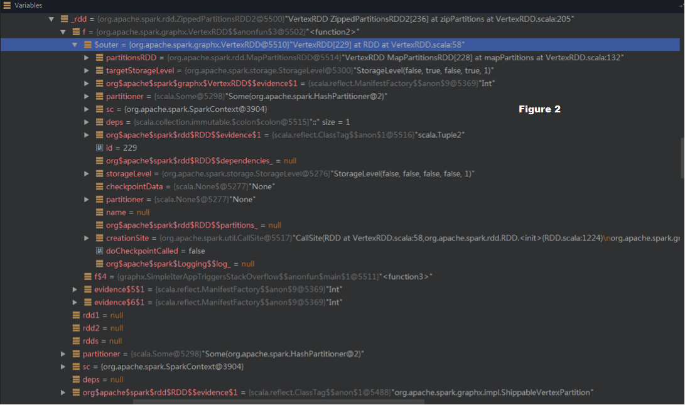

# GraphX StackOverflow错误诊断与修复过程

---
## 摘要

故事起因是我们基于GraphX设计并实现了一个迭代型的算法（KCore），在本地小数集上测试通过，但放到集群上运行后总是出现StackOverflow错误。起初我们认为错误原因是某些RDD的lineage随着算法迭代次数增加而不断变长，最后导致Spark在序列化该lineage的时候调用栈溢出。为了解决这个问题，我们通过定期checkpoint来截断lineage。可是checkpoint后，错误仍然出现。迫不得已，我们进行了更为细致的debug来查找是否还有其他影响因素，最后终于找出错误原因还与RDD的 f 函数闭包和GraphX中的一个小bug有关。这两个因素导致task的序列化链可以穿越断掉的lineage，也就是随着迭代次数增加不断增长，最终造成StackOverflow错误。我们提交了3个PR来修复这个错误，虽然都被merge了，但目前来看解决方法还不够优雅。

## 错误描述

当我们运行一个类似下面的迭代型GraphX算法（完整版参见[1]）时，会在第300+轮出现StackOverflow错误，这个错误由JDK内部的序列化/反序列化方法抛出。

算法及这类算法的特点：

1. 具有很长的computing chain

		比如下面的 “degreeGraph=>subGraph=>degreeGraph=>subGraph=>…=>”
		
2. 迭代非常多次才能收敛

		//K-Core Algorithm
		val kNum = 5
	
		var degreeGraph = graph.outerJoinVertices(graph.degrees) {
			(vid, vd, degree) => degree.getOrElse(0)
		}.cache()
	
		do {
			val subGraph = degreeGraph.subgraph(
				vpred = (vid, degree) => degree >= KNum
			).cache()
	
			val newDegreeGraph = subGraph.degrees
	
			degreeGraph = subGraph.outerJoinVertices(newDegreeGraph) {
			    (vid, vd, degree) => degree.getOrElse(0)
			}.cache()
	
			isConverged = check(degreeGraph)
		} while(isConverged == false)

产生的错误栈1（在JDK序列化时产生）：

    Exception in thread "main" org.apache.spark.SparkException: 
	Job aborted due to stage failure: Task serialization failed: java.lang.StackOverflowError
		java.io.ObjectOutputStream.writeNonProxyDesc(ObjectOutputStream.java:1275)
		java.io.ObjectOutputStream.writeClassDesc(ObjectOutputStream.java:1230)
		...
		java.io.ObjectOutputStream.writeObject0(ObjectOutputStream.java:1177)
		java.io.ObjectOutputStream.writeObject(ObjectOutputStream.java:347)
		scala.collection.immutable.$colon$colon.writeObject(List.scala:379)
		sun.reflect.GeneratedMethodAccessor3.invoke(Unknown Source)
		sun.reflect.DelegatingMethodAccessorImpl.invoke(DelegatingMethodAccessorImpl.java:43)
		java.lang.reflect.Method.invoke(Method.java:606)

产生的错误栈2（在JDK反序列化时产生）：
	
    ERROR Executor: Exception in task 1.0 in stage 339993.0 (TID 3341)
    java.lang.StackOverflowError
		at java.lang.StringBuilder.append(StringBuilder.java:204)
		at java.io.ObjectInputStream$BlockDataInputStream.readUTFSpan(ObjectInputStream.java:3143)
		...
    	java.io.ObjectInputStream.readObject0(ObjectInputStream.java:1350)
    	java.io.ObjectInputStream.readObject(ObjectInputStream.java:370)
    	scala.collection.immutable.$colon$colon.readObject(List.scala:362)
    	sun.reflect.GeneratedMethodAccessor2.invoke(Unknown Source)
    	sun.reflect.DelegatingMethodAccessorImpl.invoke(DelegatingMethodAccessorImpl.java:43)
    	java.lang.reflect.Method.invoke(Method.java:606)
   		java.io.ObjectStreamClass.invokeReadObject(ObjectStreamClass.java:1017)
	

## 错误分析

上面的日志显示这个错误在task序列化/反序列化时产生，我们首先定位到error被抛出的地点是在

1. driver端在序列化task的时候。具体地点在DAGScheduler.scala
    
        if (stage.isShuffleMap) { //如果是shuffleMapTask就序列化stage中最后一个RDD及Shuffle依赖关系
            closureSerializer.serialize((stage.rdd, stage.shuffleDep.get) : AnyRef).array()
        } else { //如果是ReduceTask就序列化stage中最后一个RDD及用于计算结果的func
            closureSerializer.serialize((stage.rdd, stage.resultOfJob.get.func) : AnyRef).array()
        }

2. executor端在反序列化task的时候。具体地点在

	ShuffleMapTask.scala

 		val (rdd, dep) = ser.deserialize[(RDD[_], ShuffleDependency[_, _, _])](
      		ByteBuffer.wrap(taskBinary.value), 
			Thread.currentThread.getContextClassLoader)

	或 ResultTask.scala

        val (rdd, func) = ser.deserialize[(RDD[T], 
			(TaskContext, Iterator[T]) => U)](ByteBuffer.wrap(taskBinary.value),
			Thread.currentThread.getContextClassLoader)

所以，我们认定原因是Spark在序列化task时产生了一条很长的调用链（以下称为序列化链），但是这条链是什么？为什么会那么长？

1. 分析task在序列化时要序列化哪些内容：

    首先明确一个概念：每个stage生成一组task。Task在序列化的时候主要是要序列化stage中的最后一个RDD（后面称为finalRDD）。我们分析了RDD的代码，发现在序列化RDD时，需要序列化RDD的成员变量有RDD id，dependencies\_，storageLevel等。其中最主要的是dependencies\_变量，它存放着该RDD的依赖关系，也就是该RDD如何依赖于其他的哪些RDDs，这个依赖关系俗称lineage。设想，当序列化后的task发到remote worker node上时，executor只需要反序列化出finalRDD，然后通过它的lineage就可以从最初的数据源（或者shuffleMapTask的计算结果）一步步计算得到finalRDD。

2. 分析lineage对序列化链的影响：

	由于在序列化finalRDD的dependencies\_时会序列化finalRDD依赖的上游的RDDs的dependencies\_，那么这个序列化过程实际上是lineage的回溯过程。假设lineage是这样的 `RDD a => RDD b => RDD c => finalRDD`，那么首先序列化finalRDD，然后顺着dependencies去序列化RDD c，然后顺着dependencies去序列化RDD b，最后顺着dependencies去序列化RDD a。可见lineage长度越长，序列化链越长，最终可以造成栈溢出。

3. 分析lineage增长规律：
	
	虽然我们推测lineage过长是错误原因，但需要实验证明。我们选择在本地小数据集来实验（大数据上实验一次要2个小时），在小数据集上算法迭代12轮后可以收敛。我们选择了几个关键的RDD，通过RDD.toDebugString()来输出这些RDD在每轮迭代中的lineage。起初我们犯了一个小错误，将toDebugString()输出的lineage长度当作序列化时的lineage长度。经 @hashjoin 提醒ShuffledRDD可以断掉序列化时的lineage，也就是说序列化链碰到ShuffledRDD就停止了，这与stage划分方法一致。我们重新审查了每轮迭代toDebugString()输出的lineage长度，发现一个小问题：toDebugString()输出的lineage与真正的lineage有出入：真正的lineage是一个DAG，而toDebugString()输出的是一个stage tree（每个stage中的RDDs被输出成一条线性依赖链），所以像ZippedPartitionsRDD2这样同时依赖于两个RDD的依赖关系没有能够在toDebugString()输出中表示出来。为了准确计算序列化时lineage的长度，我们修改了toDebugString()方法，加入了depth信息，类似求从DAG源点到每个节点的距离，最后终于统计出来每轮迭代lineage长度会增长3。

	小插曲：由于每轮迭代产生的lineage太长，后面几轮迭代产生的lineage根本输出不了（打印lineage时产生的String会造成本地程序OutOfMemory）。没办法，我们修改了toDebugString()方法，只统计depth，不显示lineage。即使这样，如果lineage很长，toDebugString()执行时间也接受不了。

	lineage的demo参见[2]和[3]。

## 错误诊断

### 1. 尝试使用checkpoint避免错误失败

竟然找到了错误原因是不断增长的lineage，我们只需要每隔几轮就checkpoint()一次，就可以断掉不断增长的lineage，以此控制其长度。下表显示了“不进行checkpoint，每隔6轮checkpoint一次，每个8轮checkpoint一次”情况下得到的某个重要RDD的lineage长度变化规律。

|i-th iter| withoutCheckpoint|	6-checkpoint|	8-checkpoint|
|----:|--------:|------:|------:|
|1	|9	|2	|2|
|2	|12	|6	|6|
|3	|15	|9	|9|
|4	|18	|12	|12|
|5	|21	|15	|15|
|6	|24	|18	|18|
|7	|27	|2	|21|
|8	|30	|6	|24|
|9	|33	|9	|2|
|10	| 执行时间太长，算不出来	|12	|6|
|11	| 执行时间太长，算不出来	|15	|9|
|12	| 执行时间太长，算不出来	|18	|12|

结果看起来不错，checkpoint以后我们可以控制lineage的长度了，也就解决问题了。

然而，现实总是那么残酷，加上checkpoint()后，在大数据集上仍然StackOverflow了，而且还是在300+轮。

### 2. 错误本地重现

还有什么因素可以导致序列化链变长？而且随着迭代次数增长而变长？而且checkpoint()也断不了？

如果错误是OutOfMemory，那么直接去dump heap，找日志，分析object的来源，然后debug，等等。可惜错误是StackOverflow，这个错误产生是一瞬间的事，要debug到错误产生的那个时间点非常难，而且无法生成heap dump，而且是在集群上产生的，每测一次算法要2个多小时。

我们仔细分析了GraphX的实现代码，看每个函数都干了些什么事情，但依然没有头绪。无奈之下，我们做了一个非常tricky的尝试，修改收敛条件，让算法在小数据集上无限迭代，看错误是否能在本地重现。测试到第400+轮的时候，错误终于在本地重现。为了让错误更快地出现，我们调小了stack大小，设为128KB，这样第30+轮的时候就可以重现。

### 3. 诊断错误真正原因

本地可以重现后，下一步就是要debug到错误产生的时间点。这个点很难把握，因为一个迭代型算法产生的stage非常多，要预测哪个stage会产生error很难（也许直接catch StackOverflowError可以debug到那个时间点，但没有尝试，也可能catch的时候调用栈已经自动退栈了）。我们选择了第20轮附近的某个stage，并假定这个stage就会产生StackOverflow，然后在JDK中的ObjectOutputStream.java的writeObject()方法处设置断点，仔细观察task序列化的每一步都序列化了什么内容。我们观察了很久很久，仔细查看了几百个stack frame中的内容，发现除了序列化RDD及其依赖关系以外，还序列化了一个奇怪的东西，那就是RDD的 f 函数闭包的$outer，而这个$outer指向外部类VertexRDD，所以VertexRDD也被序列化了。而在序列化VertexRDD时又序列化了它的成员变量PartitionsRDD。这个`f -> $outer (VertexRDD) -> PartitionsRDD` 的序列化链不属于正常的lineage，可能是错误原因。

经过深入的源代码分析+stack分析，我们最后确定这条链可以重新连接被checkpoint断掉的lineage，也就是说序列化的时候可以不通过正常的lineage访问到以前迭代产生的RDDs。图示如下：

所有被OneToOneDep连接的RDD是正常的lineage，这些RDD也会被正常序列化。如果某个RDD被checkpoint，比如图中的A，那么A的依赖链会被断掉（dependencies\_被置为null），这样序列化到A或者ShuffledRDD就停止了。然而，由于A的 f 的函数闭包引用了VertexRDD，而partitionsRDD又是VertexRDD的成员变量，当序列化到A的时候会顺着(1)->(2)的链又访问到RDDs in previous iteartions，最后造成序列化链与checkpoint前的lineage一样长。这样，随着迭代次数增加，lineage不断变长，序列化链不断变长，最后就StackOverflow了。

下图显示了我们debug到的`ZippedPartitionsRDD2 -> f -> $outer -> partitionsRDD`的序列化链。

更严重的是，单单这条链不断迭代就可以造成StackOverflow，下图显示了连续不断的，与checkpoint之前一样长的序列化链`VertexRDD -> partitionsRDD -> f -> $outer -> partitionsRDD -> f -> $outer -> VertexRDD -> ...`

## 错误总结

至此，我们得到StackOverflow的原因：

1. lineage过长，且随着迭代次数增加而增长
2. 异常的 f 函数闭包，即产生外部引用$outer的 f 闭包。
3. GraphX小bug：partitionsRDD是VertexRDD的non-transient成员变量

## 错误修复

从上面分析可以看出，只需要切断Figure 1中的(1)或(2)就可以达到截断序列化链的目的。

截断(1)的方法有两种：

1. 修改GraphX的代码结构，使得partitionsRDD的 f 的函数闭包不再引用VertexRDD。目前来看这种方法不行，因为需要重构代码。
2. 在checkpoint的时候将RDD的 f 置为null。这样如果A被checkpoint，那么f函数闭包会同时被清理掉，就不存在链接(1)了。

截断(2)的方法很简单：

- 直接将partitionsRDD置为transient，相当于序列化时partitionsRDD不是VertexRDD的成员变量，也就不存在连接(2)了。由于partitionsRDD已经通过lineage序列化，不用担心置为transient后会造成task不能计算的情况。

我们针对这三个方法，提交了 [issue](https://issues.apache.org/jira/browse/SPARK-4672) 和三个PR，目前都被merge到master和Spark-1.2版本中了。

另外，我们发现之前有位同学 @witgo 提交了一个 [issue](https://issues.apache.org/jira/browse/SPARK-3623) 讨论了Graph的checkpoint问题和修复方法，但没有提到StackOverflow error。

## 进一步讨论

虽然上面的解决方案可以解决GraphX中迭代算法的问题，但其他迭代算法呢？通过上面的错误诊断，commiters（包括 @Jason Dai）和我们认识到这是一个general的问题，即：怎么保证task和RDD在序列化时只序列化“重要的”的东西，而自动去除不必要的引用？@Jason Dai给出了一些解决思路，见 [issue](https://issues.apache.org/jira/browse/SPARK-4672) 里面的 comments。如果大家有新的思路或者具体的思路实现可以讨论、提交新的PR。

这个问题只是系统可靠性和性能优化方面问题的冰山一角，我们还遇到一些可靠性与性能 trade-off 方面的一些问题，也在考虑怎么有更优雅的解决方案。

## References
[1] 造成StackOverflow的完整代码,（需要将最后的收敛条件设置为`filteredCount >= 0L`才能无限迭代产生错误）
	
	package graphx.test

	import org.apache.hadoop.conf.Configuration
	import org.apache.hadoop.fs.{Path, FileSystem}
	import org.apache.spark.SparkContext
	import org.apache.spark.graphx._
	import org.apache.spark.rdd.RDD

	/**
	 * Created by lijie.xlj on 2014/11/26.
	 */
	object SimpleIterAppTriggersStackOverflow {
	
	  def main(args: Array[String]) {

	    val sc = new SparkContext("local[2]", "Kcore")
	    val checkpointPath = "D:\\data\\checkpoint"
	    sc.setCheckpointDir(checkpointPath)
	
	
	    val edges: RDD[(Long, Long)] =
	      sc.parallelize(Array(
	        (1L, 17L), (2L, 4L),
	        (3L, 4L), (4L, 17L),
	        (4L, 16L), (5L, 15L),
	        (6L, 7L), (7L, 15L),
	        (8L, 12L), (9L, 12L),
	        (10L, 12L), (11L, 12L),
	        (12L, 18L), (13L, 14L),
	        (13L, 17L), (14L, 17L),
	        (15L, 16L), (15L, 19L),
	        (16L, 17L), (16L, 18L),
	        (16L, 19L), (17L, 18L),
	        (17L, 19L), (18L, 19L)))
	
	
	    val graph = Graph.fromEdgeTuples(edges, 1).cache()
	
	    var degreeGraph = graph.outerJoinVertices(graph.degrees) {
	      (vid, vd, degree) => degree.getOrElse(0)
	    }.cache()
	
	    var filteredCount = 0L
	    var iters = 0
	
	    val kNum = 5
	    val checkpointInterval = 10
	
	    do {
	
	      val subGraph = degreeGraph.subgraph(vpred = (vid, degree) => degree >= kNum).cache()
	
	      val preDegreeGraph = degreeGraph
	      degreeGraph = subGraph.outerJoinVertices(subGraph.degrees) {
	        (vid, vd, degree) => degree.getOrElse(0)
	      }.cache()
	
	      if (iters % checkpointInterval == 0) {
	
	        try {
	          val fs = FileSystem.get(new Configuration())
	          if (fs.exists(new Path(checkpointPath)))
	            fs.delete(new Path(checkpointPath), true)
	        } catch {
	          case e: Throwable => {
	            e.printStackTrace()
	            println("Something Wrong in GetKCoreGraph Checkpoint Path " + checkpointPath)
	            System.exit(0)
	          }
	        }
	
	        degreeGraph.edges.checkpoint()
	        degreeGraph.vertices.checkpoint()
	
	      }
	
	      val dVertices = degreeGraph.vertices.count()
	      val dEdges = degreeGraph.edges.count()
	
	      println("[Iter " + iters + "] dVertices = " + dVertices + ", dEdges = " + dEdges)
	
	      filteredCount = degreeGraph.vertices.filter {
	        case (vid, degree) => degree < kNum
	      }.count()
	
	      preDegreeGraph.unpersistVertices()
	      preDegreeGraph.edges.unpersist()
	      subGraph.unpersistVertices()
	      subGraph.edges.unpersist()
	
	
	      iters += 1
	    } while (filteredCount >= 1L) 
	
	    println(degreeGraph.vertices.count())
	  }
	}

[2] lineage demo,未加checkpoint，第一轮迭代

	[Iter 1][DEBUG] (2) EdgeRDD[33] at RDD at EdgeRDD.scala:35
	|  EdgeRDD ZippedPartitionsRDD2[32] at zipPartitions at ReplicatedVertexView.scala:114
	|  EdgeRDD MapPartitionsRDD[12] at mapPartitionsWithIndex at EdgeRDD.scala:169
	|  MappedRDD[11] at map at Graph.scala:392
	|  MappedRDD[10] at distinct at KCoreCommonDebug.scala:115
	|  ShuffledRDD[9] at distinct at KCoreCommonDebug.scala:115
	+-(2) MappedRDD[8] at distinct at KCoreCommonDebug.scala:115
	    |  FilteredRDD[7] at filter at KCoreCommonDebug.scala:112
	    |  MappedRDD[6] at map at KCoreCommonDebug.scala:102
	    |  MappedRDD[5] at repartition at KCoreCommonDebug.scala:101
	    |  CoalescedRDD[4] at repartition at KCoreCommonDebug.scala:101
	    |  ShuffledRDD[3] at repartition at KCoreCommonDebug.scala:101
	    +-(2) MapPartitionsRDD[2] at repartition at KCoreCommonDebug.scala:101
	       |  D:\graphData\verylarge.txt MappedRDD[1] at textFile at KCoreCommonDebug.scala:100
	       |  D:\graphData\verylarge.txt HadoopRDD[0] at textFile at KCoreCommonDebug.scala:100
	|  ShuffledRDD[31] at partitionBy at ReplicatedVertexView.scala:112
	+-(2) ReplicatedVertexView.updateVertices - shippedVerts false false (broadcast) MapPartitionsRDD[30] at mapPartitions at VertexRDD.scala:347
	    |  VertexRDD ZippedPartitionsRDD2[28] at zipPartitions at VertexRDD.scala:174
	    |  VertexRDD, VertexRDD MapPartitionsRDD[18] at mapPartitions at VertexRDD.scala:441
	    |  MapPartitionsRDD[17] at mapPartitions at VertexRDD.scala:457
	    |  ShuffledRDD[16] at ShuffledRDD at RoutingTablePartition.scala:36
	    +-(2) VertexRDD.createRoutingTables - vid2pid (aggregation) MapPartitionsRDD[15] at mapPartitions at VertexRDD.scala:452
	       |  EdgeRDD MapPartitionsRDD[12] at mapPartitionsWithIndex at EdgeRDD.scala:169
	       |  MappedRDD[11] at map at Graph.scala:392
	       |  MappedRDD[10] at distinct at KCoreCommonDebug.scala:115
	       |  ShuffledRDD[9] at distinct at KCoreCommonDebug.scala:115
	       +-(2) MappedRDD[8] at distinct at KCoreCommonDebug.scala:115
	          |  FilteredRDD[7] at filter at KCoreCommonDebug.scala:112
	          |  MappedRDD[6] at map at KCoreCommonDebug.scala:102
	          |  MappedRDD[5] at repartition at KCoreCommonDebug.scala:101
	          |  CoalescedRDD[4] at repartition at KCoreCommonDebug.scala:101
	          |  ShuffledRDD[3] at repartition at KCoreCommonDebug.scala:101
	          +-(2) MapPartitionsRDD[2] at repartition at KCoreCommonDebug.scala:101
	             |  D:\graphData\verylarge.txt MappedRDD[1] at textFile at KCoreCommonDebug.scala:100
	             |  D:\graphData\verylarge.txt HadoopRDD[0] at textFile at KCoreCommonDebug.scala:100
	    |  VertexRDD ZippedPartitionsRDD2[26] at zipPartitions at VertexRDD.scala:200
	    |  VertexRDD, VertexRDD MapPartitionsRDD[18] at mapPartitions at VertexRDD.scala:441
	    |  MapPartitionsRDD[17] at mapPartitions at VertexRDD.scala:457
	    |  ShuffledRDD[16] at ShuffledRDD at RoutingTablePartition.scala:36
	    +-(2) VertexRDD.createRoutingTables - vid2pid (aggregation) MapPartitionsRDD[15] at mapPartitions at VertexRDD.scala:452
	       |  EdgeRDD MapPartitionsRDD[12] at mapPartitionsWithIndex at EdgeRDD.scala:169
	       |  MappedRDD[11] at map at Graph.scala:392
	       |  MappedRDD[10] at distinct at KCoreCommonDebug.scala:115
	       |  ShuffledRDD[9] at distinct at KCoreCommonDebug.scala:115
	       +-(2) MappedRDD[8] at distinct at KCoreCommonDebug.scala:115
	          |  FilteredRDD[7] at filter at KCoreCommonDebug.scala:112
	          |  MappedRDD[6] at map at KCoreCommonDebug.scala:102
	          |  MappedRDD[5] at repartition at KCoreCommonDebug.scala:101
	          |  CoalescedRDD[4] at repartition at KCoreCommonDebug.scala:101
	          |  ShuffledRDD[3] at repartition at KCoreCommonDebug.scala:101
	          +-(2) MapPartitionsRDD[2] at repartition at KCoreCommonDebug.scala:101
	             |  D:\graphData\verylarge.txt MappedRDD[1] at textFile at KCoreCommonDebug.scala:100
	             |  D:\graphData\verylarge.txt HadoopRDD[0] at textFile at KCoreCommonDebug.scala:100
	    |  VertexRDD, GraphOps.degrees ZippedPartitionsRDD2[24] at zipPartitions at VertexRDD.scala:301
	    |  VertexRDD, VertexRDD MapPartitionsRDD[18] at mapPartitions at VertexRDD.scala:441
	    |  MapPartitionsRDD[17] at mapPartitions at VertexRDD.scala:457
	    |  ShuffledRDD[16] at ShuffledRDD at RoutingTablePartition.scala:36
	   +-(2) VertexRDD.createRoutingTables - vid2pid (aggregation) MapPartitionsRDD[15] at mapPartitions at VertexRDD.scala:452
	       |  EdgeRDD MapPartitionsRDD[12] at mapPartitionsWithIndex at EdgeRDD.scala:169
	       |  MappedRDD[11] at map at Graph.scala:392
	       |  MappedRDD[10] at distinct at KCoreCommonDebug.scala:115
	       |  ShuffledRDD[9] at distinct at KCoreCommonDebug.scala:115
	       +-(2) MappedRDD[8] at distinct at KCoreCommonDebug.scala:115
	          |  FilteredRDD[7] at filter at KCoreCommonDebug.scala:112
	          |  MappedRDD[6] at map at KCoreCommonDebug.scala:102
	          |  MappedRDD[5] at repartition at KCoreCommonDebug.scala:101
	          |  CoalescedRDD[4] at repartition at KCoreCommonDebug.scala:101
	          |  ShuffledRDD[3] at repartition at KCoreCommonDebug.scala:101
	          +-(2) MapPartitionsRDD[2] at repartition at KCoreCommonDebug.scala:101
	             |  D:\graphData\verylarge.txt MappedRDD[1] at textFile at KCoreCommonDebug.scala:100
	             |  D:\graphData\verylarge.txt HadoopRDD[0] at textFile at KCoreCommonDebug.scala:100
	    |  ShuffledRDD[23] at ShuffledRDD at MessageToPartition.scala:31
	    +-(2) GraphImpl.mapReduceTriplets - preAgg MapPartitionsRDD[22] at mapPartitions at GraphImpl.scala:192
	       |  EdgeRDD MapPartitionsRDD[12] at mapPartitionsWithIndex at EdgeRDD.scala:169
	       |  MappedRDD[11] at map at Graph.scala:392
	       |  MappedRDD[10] at distinct at KCoreCommonDebug.scala:115
	       |  ShuffledRDD[9] at distinct at KCoreCommonDebug.scala:115
	       +-(2) MappedRDD[8] at distinct at KCoreCommonDebug.scala:115
	          |  FilteredRDD[7] at filter at KCoreCommonDebug.scala:112
	          |  MappedRDD[6] at map at KCoreCommonDebug.scala:102
	          |  MappedRDD[5] at repartition at KCoreCommonDebug.scala:101
	          |  CoalescedRDD[4] at repartition at KCoreCommonDebug.scala:101
	          |  ShuffledRDD[3] at repartition at KCoreCommonDebug.scala:101
	          +-(2) MapPartitionsRDD[2] at repartition at KCoreCommonDebug.scala:101
	            |  D:\graphData\verylarge.txt MappedRDD[1] at textFile at KCoreCommonDebug.scala:100
	             |  D:\graphData\verylarge.txt HadoopRDD[0] at textFile at KCoreCommonDebug.scala:100
[3] lineage demo,加checkpoint，第5轮迭代

	[Iter 5][DEBUG] (2) VertexRDD[113] at RDD at VertexRDD.scala:58
	|  VertexRDD ZippedPartitionsRDD2[112] at zipPartitions at VertexRDD.scala:200
	|  VertexRDD MapPartitionsRDD[103] at mapPartitions at VertexRDD.scala:127
	|  VertexRDD ZippedPartitionsRDD2[91] at zipPartitions at VertexRDD.scala:200
	|  VertexRDD MapPartitionsRDD[82] at mapPartitions at VertexRDD.scala:127
	|  VertexRDD ZippedPartitionsRDD2[70] at zipPartitions at VertexRDD.scala:200
	|  VertexRDD MapPartitionsRDD[61] at mapPartitions at VertexRDD.scala:127
	|  VertexRDD ZippedPartitionsRDD2[47] at zipPartitions at VertexRDD.scala:200
	|  CheckpointRDD[56] at apply at List.scala:318
	|  VertexRDD, GraphOps.degrees ZippedPartitionsRDD2[68] at zipPartitions at VertexRDD.scala:301
	|  VertexRDD MapPartitionsRDD[61] at mapPartitions at VertexRDD.scala:127
	|  VertexRDD ZippedPartitionsRDD2[47] at zipPartitions at VertexRDD.scala:200
	|  CheckpointRDD[56] at apply at List.scala:318
	|  ShuffledRDD[67] at ShuffledRDD at MessageToPartition.scala:31
	+-(2) GraphImpl.mapReduceTriplets - preAgg MapPartitionsRDD[66] at mapPartitions at GraphImpl.scala:192
	    |  EdgeRDD MapPartitionsRDD[63] at mapPartitions at EdgeRDD.scala:85
	    |  EdgeRDD ZippedPartitionsRDD2[53] at zipPartitions at ReplicatedVertexView.scala:114
	    |  CheckpointRDD[57] at apply at List.scala:318
	|  VertexRDD, GraphOps.degrees ZippedPartitionsRDD2[89] at zipPartitions at VertexRDD.scala:301
	|  VertexRDD MapPartitionsRDD[82] at mapPartitions at VertexRDD.scala:127
	|  VertexRDD ZippedPartitionsRDD2[70] at zipPartitions at VertexRDD.scala:200
	|  VertexRDD MapPartitionsRDD[61] at mapPartitions at VertexRDD.scala:127
	|  VertexRDD ZippedPartitionsRDD2[47] at zipPartitions at VertexRDD.scala:200
	|  CheckpointRDD[56] at apply at List.scala:318
	|  VertexRDD, GraphOps.degrees ZippedPartitionsRDD2[68] at zipPartitions at VertexRDD.scala:301
	|  VertexRDD MapPartitionsRDD[61] at mapPartitions at VertexRDD.scala:127
	|  VertexRDD ZippedPartitionsRDD2[47] at zipPartitions at VertexRDD.scala:200
	|  CheckpointRDD[56] at apply at List.scala:318
	|  ShuffledRDD[67] at ShuffledRDD at MessageToPartition.scala:31
	+-(2) GraphImpl.mapReduceTriplets - preAgg MapPartitionsRDD[66] at mapPartitions at GraphImpl.scala:192
	    |  EdgeRDD MapPartitionsRDD[63] at mapPartitions at EdgeRDD.scala:85
	    |  EdgeRDD ZippedPartitionsRDD2[53] at zipPartitions at ReplicatedVertexView.scala:114
	    |  CheckpointRDD[57] at apply at List.scala:318
	|  ShuffledRDD[88] at ShuffledRDD at MessageToPartition.scala:31
	+-(2) GraphImpl.mapReduceTriplets - preAgg MapPartitionsRDD[87] at mapPartitions at GraphImpl.scala:192
	    |  EdgeRDD MapPartitionsRDD[84] at mapPartitions at EdgeRDD.scala:85
	    |  EdgeRDD ZippedPartitionsRDD2[76] at zipPartitions at ReplicatedVertexView.scala:114
	    |  EdgeRDD MapPartitionsRDD[63] at mapPartitions at EdgeRDD.scala:85
	    |  EdgeRDD ZippedPartitionsRDD2[53] at zipPartitions at ReplicatedVertexView.scala:114
	    |  CheckpointRDD[57] at apply at List.scala:318
	    |  ShuffledRDD[75] at partitionBy at ReplicatedVertexView.scala:112
	    +-(2) ReplicatedVertexView.updateVertices - shippedVerts true true (broadcast) MapPartitionsRDD[74] at mapPartitions at VertexRDD.scala:347
	       |  VertexRDD ZippedPartitionsRDD2[72] at zipPartitions at VertexRDD.scala:174
	       |  VertexRDD MapPartitionsRDD[61] at mapPartitions at VertexRDD.scala:127
	       |  VertexRDD ZippedPartitionsRDD2[47] at zipPartitions at VertexRDD.scala:200
	       |  CheckpointRDD[56] at apply at List.scala:318
	       |  VertexRDD ZippedPartitionsRDD2[70] at zipPartitions at VertexRDD.scala:200
	       |  VertexRDD MapPartitionsRDD[61] at mapPartitions at VertexRDD.scala:127
	       |  VertexRDD ZippedPartitionsRDD2[47] at zipPartitions at VertexRDD.scala:200
	       |  CheckpointRDD[56] at apply at List.scala:318
	       |  VertexRDD, GraphOps.degrees ZippedPartitionsRDD2[68] at zipPartitions at VertexRDD.scala:301
	       |  VertexRDD MapPartitionsRDD[61] at mapPartitions at VertexRDD.scala:127
	       |  VertexRDD ZippedPartitionsRDD2[47] at zipPartitions at VertexRDD.scala:200
	       |  CheckpointRDD[56] at apply at List.scala:318
	       |  ShuffledRDD[67] at ShuffledRDD at MessageToPartition.scala:31
	       +-(2) GraphImpl.mapReduceTriplets - preAgg MapPartitionsRDD[66] at mapPartitions at GraphImpl.scala:192
	          |  EdgeRDD MapPartitionsRDD[63] at mapPartitions at EdgeRDD.scala:85
	          |  EdgeRDD ZippedPartitionsRDD2[53] at zipPartitions at ReplicatedVertexView.scala:114
	          |  CheckpointRDD[57] at apply at List.scala:318
	|  VertexRDD, GraphOps.degrees ZippedPartitionsRDD2[110] at zipPartitions at VertexRDD.scala:301
	|  VertexRDD MapPartitionsRDD[103] at mapPartitions at VertexRDD.scala:127
	|  VertexRDD ZippedPartitionsRDD2[91] at zipPartitions at VertexRDD.scala:200
	|  VertexRDD MapPartitionsRDD[82] at mapPartitions at VertexRDD.scala:127
	|  VertexRDD ZippedPartitionsRDD2[70] at zipPartitions at VertexRDD.scala:200
	|  VertexRDD MapPartitionsRDD[61] at mapPartitions at VertexRDD.scala:127
	|  VertexRDD ZippedPartitionsRDD2[47] at zipPartitions at VertexRDD.scala:200
	|  CheckpointRDD[56] at apply at List.scala:318
	|  VertexRDD, GraphOps.degrees ZippedPartitionsRDD2[68] at zipPartitions at VertexRDD.scala:301
	|  VertexRDD MapPartitionsRDD[61] at mapPartitions at VertexRDD.scala:127
	|  VertexRDD ZippedPartitionsRDD2[47] at zipPartitions at VertexRDD.scala:200
	|  CheckpointRDD[56] at apply at List.scala:318
	|  ShuffledRDD[67] at ShuffledRDD at MessageToPartition.scala:31
	+-(2) GraphImpl.mapReduceTriplets - preAgg MapPartitionsRDD[66] at mapPartitions at GraphImpl.scala:192
	    |  EdgeRDD MapPartitionsRDD[63] at mapPartitions at EdgeRDD.scala:85
	    |  EdgeRDD ZippedPartitionsRDD2[53] at zipPartitions at ReplicatedVertexView.scala:114
	    |  CheckpointRDD[57] at apply at List.scala:318
	|  VertexRDD, GraphOps.degrees ZippedPartitionsRDD2[89] at zipPartitions at VertexRDD.scala:301
	|  VertexRDD MapPartitionsRDD[82] at mapPartitions at VertexRDD.scala:127
	|  VertexRDD ZippedPartitionsRDD2[70] at zipPartitions at VertexRDD.scala:200
	|  VertexRDD MapPartitionsRDD[61] at mapPartitions at VertexRDD.scala:127
	|  VertexRDD ZippedPartitionsRDD2[47] at zipPartitions at VertexRDD.scala:200
	|  CheckpointRDD[56] at apply at List.scala:318
	|  VertexRDD, GraphOps.degrees ZippedPartitionsRDD2[68] at zipPartitions at VertexRDD.scala:301
	|  VertexRDD MapPartitionsRDD[61] at mapPartitions at VertexRDD.scala:127
	|  VertexRDD ZippedPartitionsRDD2[47] at zipPartitions at VertexRDD.scala:200
	|  CheckpointRDD[56] at apply at List.scala:318
	|  ShuffledRDD[67] at ShuffledRDD at MessageToPartition.scala:31
	+-(2) GraphImpl.mapReduceTriplets - preAgg MapPartitionsRDD[66] at mapPartitions at GraphImpl.scala:192
	    |  EdgeRDD MapPartitionsRDD[63] at mapPartitions at EdgeRDD.scala:85
	    |  EdgeRDD ZippedPartitionsRDD2[53] at zipPartitions at ReplicatedVertexView.scala:114
	    |  CheckpointRDD[57] at apply at List.scala:318
	|  ShuffledRDD[88] at ShuffledRDD at MessageToPartition.scala:31
	+-(2) GraphImpl.mapReduceTriplets - preAgg MapPartitionsRDD[87] at mapPartitions at GraphImpl.scala:192
	    |  EdgeRDD MapPartitionsRDD[84] at mapPartitions at EdgeRDD.scala:85
	    |  EdgeRDD ZippedPartitionsRDD2[76] at zipPartitions at ReplicatedVertexView.scala:114
	    |  EdgeRDD MapPartitionsRDD[63] at mapPartitions at EdgeRDD.scala:85
	    |  EdgeRDD ZippedPartitionsRDD2[53] at zipPartitions at ReplicatedVertexView.scala:114
	    |  CheckpointRDD[57] at apply at List.scala:318
	    |  ShuffledRDD[75] at partitionBy at ReplicatedVertexView.scala:112
	    +-(2) ReplicatedVertexView.updateVertices - shippedVerts true true (broadcast) MapPartitionsRDD[74] at mapPartitions at VertexRDD.scala:347
	       |  VertexRDD ZippedPartitionsRDD2[72] at zipPartitions at VertexRDD.scala:174
	       |  VertexRDD MapPartitionsRDD[61] at mapPartitions at VertexRDD.scala:127
	       |  VertexRDD ZippedPartitionsRDD2[47] at zipPartitions at VertexRDD.scala:200
	       |  CheckpointRDD[56] at apply at List.scala:318
	       |  VertexRDD ZippedPartitionsRDD2[70] at zipPartitions at VertexRDD.scala:200
	       |  VertexRDD MapPartitionsRDD[61] at mapPartitions at VertexRDD.scala:127
	       |  VertexRDD ZippedPartitionsRDD2[47] at zipPartitions at VertexRDD.scala:200
	       |  CheckpointRDD[56] at apply at List.scala:318
	       |  VertexRDD, GraphOps.degrees ZippedPartitionsRDD2[68] at zipPartitions at VertexRDD.scala:301
	       |  VertexRDD MapPartitionsRDD[61] at mapPartitions at VertexRDD.scala:127
	       |  VertexRDD ZippedPartitionsRDD2[47] at zipPartitions at VertexRDD.scala:200
	       |  CheckpointRDD[56] at apply at List.scala:318
	       |  ShuffledRDD[67] at ShuffledRDD at MessageToPartition.scala:31
	       +-(2) GraphImpl.mapReduceTriplets - preAgg MapPartitionsRDD[66] at mapPartitions at GraphImpl.scala:192
	          |  EdgeRDD MapPartitionsRDD[63] at mapPartitions at EdgeRDD.scala:85
	          |  EdgeRDD ZippedPartitionsRDD2[53] at zipPartitions at ReplicatedVertexView.scala:114
	          |  CheckpointRDD[57] at apply at List.scala:318
	|  ShuffledRDD[109] at ShuffledRDD at MessageToPartition.scala:31
	+-(2) GraphImpl.mapReduceTriplets - preAgg MapPartitionsRDD[108] at mapPartitions at GraphImpl.scala:192
	    |  EdgeRDD MapPartitionsRDD[105] at mapPartitions at EdgeRDD.scala:85
	    |  EdgeRDD ZippedPartitionsRDD2[97] at zipPartitions at ReplicatedVertexView.scala:114
	    |  EdgeRDD MapPartitionsRDD[84] at mapPartitions at EdgeRDD.scala:85
	    |  EdgeRDD ZippedPartitionsRDD2[76] at zipPartitions at ReplicatedVertexView.scala:114
	    |  EdgeRDD MapPartitionsRDD[63] at mapPartitions at EdgeRDD.scala:85
	    |  EdgeRDD ZippedPartitionsRDD2[53] at zipPartitions at ReplicatedVertexView.scala:114
	    |  CheckpointRDD[57] at apply at List.scala:318
	    |  ShuffledRDD[75] at partitionBy at ReplicatedVertexView.scala:112
	    +-(2) ReplicatedVertexView.updateVertices - shippedVerts true true (broadcast) MapPartitionsRDD[74] at mapPartitions at VertexRDD.scala:347
	       |  VertexRDD ZippedPartitionsRDD2[72] at zipPartitions at VertexRDD.scala:174
	       |  VertexRDD MapPartitionsRDD[61] at mapPartitions at VertexRDD.scala:127
	       |  VertexRDD ZippedPartitionsRDD2[47] at zipPartitions at VertexRDD.scala:200
	       |  CheckpointRDD[56] at apply at List.scala:318
	       |  VertexRDD ZippedPartitionsRDD2[70] at zipPartitions at VertexRDD.scala:200
	       |  VertexRDD MapPartitionsRDD[61] at mapPartitions at VertexRDD.scala:127
	       |  VertexRDD ZippedPartitionsRDD2[47] at zipPartitions at VertexRDD.scala:200
	       |  CheckpointRDD[56] at apply at List.scala:318
	       |  VertexRDD, GraphOps.degrees ZippedPartitionsRDD2[68] at zipPartitions at VertexRDD.scala:301
	       |  VertexRDD MapPartitionsRDD[61] at mapPartitions at VertexRDD.scala:127
	       |  VertexRDD ZippedPartitionsRDD2[47] at zipPartitions at VertexRDD.scala:200
	       |  CheckpointRDD[56] at apply at List.scala:318
	       |  ShuffledRDD[67] at ShuffledRDD at MessageToPartition.scala:31
	       +-(2) GraphImpl.mapReduceTriplets - preAgg MapPartitionsRDD[66] at mapPartitions at GraphImpl.scala:192
	          |  EdgeRDD MapPartitionsRDD[63] at mapPartitions at EdgeRDD.scala:85
	          |  EdgeRDD ZippedPartitionsRDD2[53] at zipPartitions at ReplicatedVertexView.scala:114
	          |  CheckpointRDD[57] at apply at List.scala:318
	    |  ShuffledRDD[96] at partitionBy at ReplicatedVertexView.scala:112
	    +-(2) ReplicatedVertexView.updateVertices - shippedVerts true true (broadcast) MapPartitionsRDD[95] at mapPartitions at VertexRDD.scala:347
	       |  VertexRDD ZippedPartitionsRDD2[93] at zipPartitions at VertexRDD.scala:174
	       |  VertexRDD MapPartitionsRDD[82] at mapPartitions at VertexRDD.scala:127
	       |  VertexRDD ZippedPartitionsRDD2[70] at zipPartitions at VertexRDD.scala:200
	       |  VertexRDD MapPartitionsRDD[61] at mapPartitions at VertexRDD.scala:127
	       |  VertexRDD ZippedPartitionsRDD2[47] at zipPartitions at VertexRDD.scala:200
	       |  CheckpointRDD[56] at apply at List.scala:318
	       |  VertexRDD, GraphOps.degrees ZippedPartitionsRDD2[68] at zipPartitions at VertexRDD.scala:301
	       |  VertexRDD MapPartitionsRDD[61] at mapPartitions at VertexRDD.scala:127
	       |  VertexRDD ZippedPartitionsRDD2[47] at zipPartitions at VertexRDD.scala:200
	       |  CheckpointRDD[56] at apply at List.scala:318
	       |  ShuffledRDD[67] at ShuffledRDD at MessageToPartition.scala:31
	       +-(2) GraphImpl.mapReduceTriplets - preAgg MapPartitionsRDD[66] at mapPartitions at GraphImpl.scala:192
	          |  EdgeRDD MapPartitionsRDD[63] at mapPartitions at EdgeRDD.scala:85
	          |  EdgeRDD ZippedPartitionsRDD2[53] at zipPartitions at ReplicatedVertexView.scala:114
	          |  CheckpointRDD[57] at apply at List.scala:318
	       |  VertexRDD ZippedPartitionsRDD2[91] at zipPartitions at VertexRDD.scala:200
	       |  VertexRDD MapPartitionsRDD[82] at mapPartitions at VertexRDD.scala:127
	       |  VertexRDD ZippedPartitionsRDD2[70] at zipPartitions at VertexRDD.scala:200
	       |  VertexRDD MapPartitionsRDD[61] at mapPartitions at VertexRDD.scala:127
	       |  VertexRDD ZippedPartitionsRDD2[47] at zipPartitions at VertexRDD.scala:200
	       |  CheckpointRDD[56] at apply at List.scala:318
	       |  VertexRDD, GraphOps.degrees ZippedPartitionsRDD2[68] at zipPartitions at VertexRDD.scala:301
	       |  VertexRDD MapPartitionsRDD[61] at mapPartitions at VertexRDD.scala:127
	       |  VertexRDD ZippedPartitionsRDD2[47] at zipPartitions at VertexRDD.scala:200
	       |  CheckpointRDD[56] at apply at List.scala:318
	       |  ShuffledRDD[67] at ShuffledRDD at MessageToPartition.scala:31
	       +-(2) GraphImpl.mapReduceTriplets - preAgg MapPartitionsRDD[66] at mapPartitions at GraphImpl.scala:192
	          |  EdgeRDD MapPartitionsRDD[63] at mapPartitions at EdgeRDD.scala:85
	          |  EdgeRDD ZippedPartitionsRDD2[53] at zipPartitions at ReplicatedVertexView.scala:114
	          |  CheckpointRDD[57] at apply at List.scala:318
	       |  VertexRDD, GraphOps.degrees ZippedPartitionsRDD2[89] at zipPartitions at VertexRDD.scala:301
	       |  VertexRDD MapPartitionsRDD[82] at mapPartitions at VertexRDD.scala:127
	       |  VertexRDD ZippedPartitionsRDD2[70] at zipPartitions at VertexRDD.scala:200
	       |  VertexRDD MapPartitionsRDD[61] at mapPartitions at VertexRDD.scala:127
	       |  VertexRDD ZippedPartitionsRDD2[47] at zipPartitions at VertexRDD.scala:200
	       |  CheckpointRDD[56] at apply at List.scala:318
	       |  VertexRDD, GraphOps.degrees ZippedPartitionsRDD2[68] at zipPartitions at VertexRDD.scala:301
	       |  VertexRDD MapPartitionsRDD[61] at mapPartitions at VertexRDD.scala:127
	       |  VertexRDD ZippedPartitionsRDD2[47] at zipPartitions at VertexRDD.scala:200
	       |  CheckpointRDD[56] at apply at List.scala:318
	       |  ShuffledRDD[67] at ShuffledRDD at MessageToPartition.scala:31
	       +-(2) GraphImpl.mapReduceTriplets - preAgg MapPartitionsRDD[66] at mapPartitions at GraphImpl.scala:192
	          |  EdgeRDD MapPartitionsRDD[63] at mapPartitions at EdgeRDD.scala:85
	          |  EdgeRDD ZippedPartitionsRDD2[53] at zipPartitions at ReplicatedVertexView.scala:114
	          |  CheckpointRDD[57] at apply at List.scala:318
	       |  ShuffledRDD[88] at ShuffledRDD at MessageToPartition.scala:31
	       +-(2) GraphImpl.mapReduceTriplets - preAgg MapPartitionsRDD[87] at mapPartitions at GraphImpl.scala:192
	          |  EdgeRDD MapPartitionsRDD[84] at mapPartitions at EdgeRDD.scala:85
	          |  EdgeRDD ZippedPartitionsRDD2[76] at zipPartitions at ReplicatedVertexView.scala:114
	          |  EdgeRDD MapPartitionsRDD[63] at mapPartitions at EdgeRDD.scala:85
	          |  EdgeRDD ZippedPartitionsRDD2[53] at zipPartitions at ReplicatedVertexView.scala:114
	          |  CheckpointRDD[57] at apply at List.scala:318
	          |  ShuffledRDD[75] at partitionBy at ReplicatedVertexView.scala:112
	          +-(2) ReplicatedVertexView.updateVertices - shippedVerts true true (broadcast) MapPartitionsRDD[74] at mapPartitions at VertexRDD.scala:347
	             |  VertexRDD ZippedPartitionsRDD2[72] at zipPartitions at VertexRDD.scala:174
	             |  VertexRDD MapPartitionsRDD[61] at mapPartitions at VertexRDD.scala:127
	             |  VertexRDD ZippedPartitionsRDD2[47] at zipPartitions at VertexRDD.scala:200
	             |  CheckpointRDD[56] at apply at List.scala:318
	             |  VertexRDD ZippedPartitionsRDD2[70] at zipPartitions at VertexRDD.scala:200
	             |  VertexRDD MapPartitionsRDD[61] at mapPartitions at VertexRDD.scala:127
	             |  VertexRDD ZippedPartitionsRDD2[47] at zipPartitions at VertexRDD.scala:200
	             |  CheckpointRDD[56] at apply at List.scala:318
	             |  VertexRDD, GraphOps.degrees ZippedPartitionsRDD2[68] at zipPartitions at VertexRDD.scala:301
	             |  VertexRDD MapPartitionsRDD[61] at mapPartitions at VertexRDD.scala:127
	             |  VertexRDD ZippedPartitionsRDD2[47] at zipPartitions at VertexRDD.scala:200
	             |  CheckpointRDD[56] at apply at List.scala:318
	             |  ShuffledRDD[67] at ShuffledRDD at MessageToPartition.scala:31
	             +-(2) GraphImpl.mapReduceTriplets - preAgg MapPartitionsRDD[66] at mapPartitions at GraphImpl.scala:192
	                |  EdgeRDD MapPartitionsRDD[63] at mapPartitions at EdgeRDD.scala:85
	                |  EdgeRDD ZippedPartitionsRDD2[53] at zipPartitions at ReplicatedVertexView.scala:114
	                |  CheckpointRDD[57] at apply at List.scala:318
